# How the scraper hangs together

This document explains how a scrape runs, from the **Run** button to a wallpaper on disk and in the database. All paths are relative to `AStarDev.ScraperPlaying/` unless stated.

## 1. The big picture

The app is an Avalonia desktop UI over a pipeline that talks to the Wallhaven API, downloads images, and records them in a SQLite database (EF Core, `packages/AStarDev.ControlDb`).

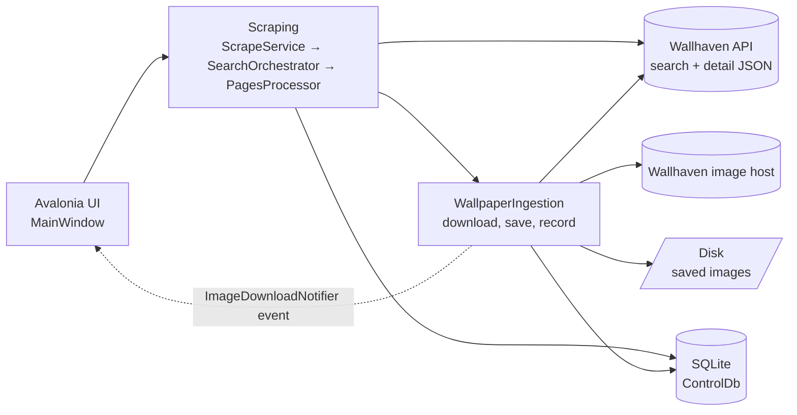

Folders are grouped by domain, not by type:

| Folder | Responsibility |
|---|---|
| `UI/` | Windows, button handlers, status log, image preview |
| `Operations/` | `OperationCoordinator` - one operation at a time, plus cancellation |
| `Scoping/` | `ScopedRunner` - runs work inside a DI scope |
| `Scraping/` | Paging through search results, resume logic, API client, rate limiting, tags |
| `WallpaperIngestion/` | Deciding what is new, downloading, saving, recording, announcing |
| `ScrapeConfiguration/` | Loading, editing, importing and exporting the configuration |
| `Startup/` | DI registration and database initialisation |

## 2. The call chain

Each layer does one job and hands down to the next.

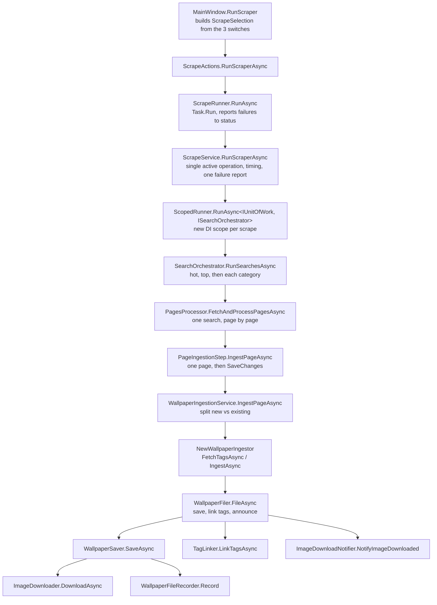

### What each class does

| Class | Method | Job |
|---|---|---|
| `UI/MainWindow` | `RunScraper` | Reads the hot, top and categories switches into a `ScrapeSelection` |
| `UI/ScrapeActions` | `RunScraperAsync`, `CancelOperation` | Button actions; cancel calls `OperationCoordinator.Cancel` |
| `UI/ScrapeRunner` | `RunAsync` | Runs the scrape on the thread pool, so continuations never resume on the UI thread; catches anything that escapes |
| `Scraping/ScrapeService` | `RunScraperAsync` | Takes the single-operation lock via `OperationCoordinator.TryStart`, times the run, reports completion, cancellation or failure once |
| `Scoping/ScopedRunner` | `RunAsync` | Creates a DI scope so scoped services (DbContext, tag linker) live for exactly one scrape |
| `Scraping/SearchOrchestrator` | `RunSearchesAsync` | Builds a `PageScrapeRequest` for hot, top, and each included category (honouring `ScrapeSelection` and `ScrapeLimits`); a `PageFetchException` ends only that search |
| `Scraping/PagesProcessor` | `FetchAndProcessPagesAsync` | Resolves the start page, applies the resume policy, loops over pages with a pacing delay |
| `Scraping/ScrapeResumePolicy` | `ResumePage`, `IsUnchangedSincePreviousScrape`, `IsLastPageToVisit` | Pure decisions: where to resume, whether to skip a finished category, when to stop |
| `Scraping/PageIngestionStep` | `IngestPageAsync` | Ingests one page, records category progress, calls `SaveChangesAsync`; on cancel it saves what was downloaded so far |
| `WallpaperIngestion/WallpaperIngestionService` | `IngestPageAsync` | Asks the DB which wallpapers already exist, skips those, pipelines tag fetching for the rest |
| `WallpaperIngestion/NewWallpaperIngestor` | `FetchTagsAsync`, `IngestAsync` | Fetches tags; wallpapers with an "ignore" tag are remembered and not downloaded |
| `WallpaperIngestion/WallpaperFiler` | `FileAsync` | Chooses directory and file name from tags, saves, links tags, announces |
| `WallpaperIngestion/WallpaperSaver` | `SaveAsync` | Downloads the image, then records a `FileEntity` |
| `WallpaperIngestion/ImageDownloader` | `DownloadAsync` | Paced download to a `.part` file, then moved into place |
| `Scraping/TagLinker` | `LinkTagsAsync` | Creates or reuses `TagEntity` rows and links them to the file |

## 3. End-to-end sequence

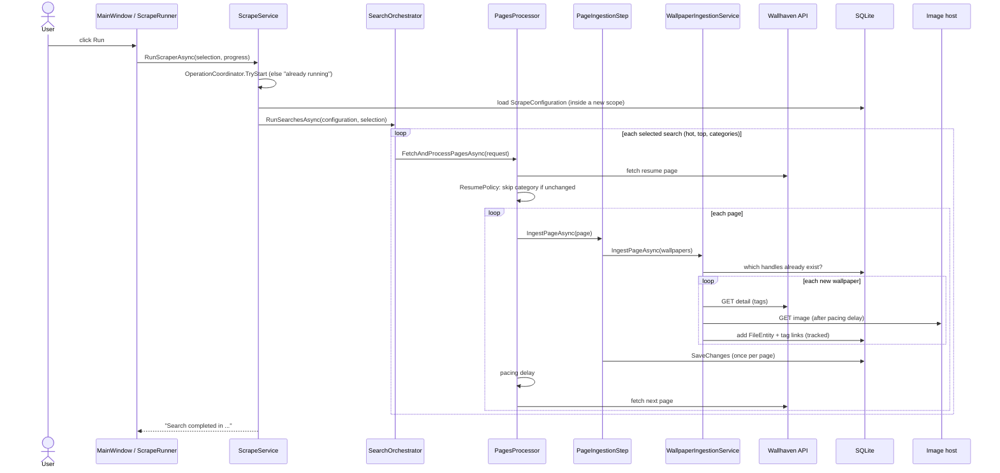

## 4. Page loop and resume logic

A category is only ever marked as progressed when a page was **fully** ingested. If any wallpaper on a page fails, progress stops moving, so the next scrape retries from that page.

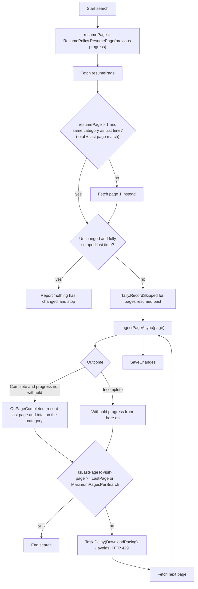

Hot and top have no stored progress (`Option.None`), so they always start at page 1.

## 5. Ingesting one page

`WallpaperIngestionService` pipelines the work: while one wallpaper downloads and is recorded, the next wallpaper's tags are already being fetched. The two are never parallel with themselves, so the API limit and the single, non-thread-safe `DbContext` are both respected.

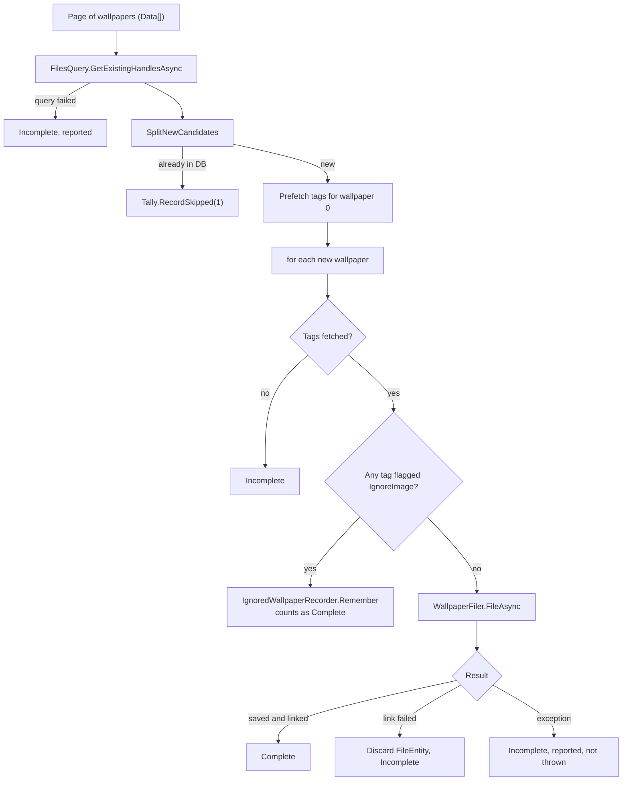

The next wallpaper's tag fetch is started before the current one is filed (`prefetch` in `IngestNewWallpapersAsync`).

### Filing one wallpaper

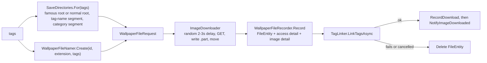

The file is recorded **before** the tags are linked. If linking fails, the entity is discarded, because otherwise the page save would keep an untagged file that later scrapes would treat as already ingested.

## 6. Counting: the "(x of y)" in the preview

`IngestionRun` carries a mutable `ScrapeTally` for the lifetime of one search.

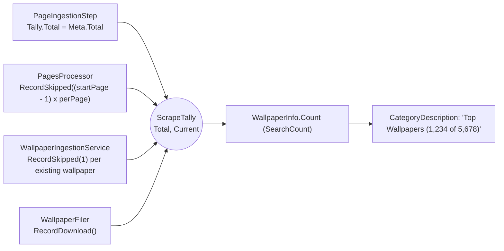

`x` therefore means downloaded plus skipped, so a partially scraped category shows a sensible number. The skip count for a resumed category is an estimate (start page number minus one, times the wallpapers on that page).

## 7. The preview: from background thread to UI

Ingestion runs on a thread-pool thread, so the preview is decoupled by an event and a coalescing decoder.

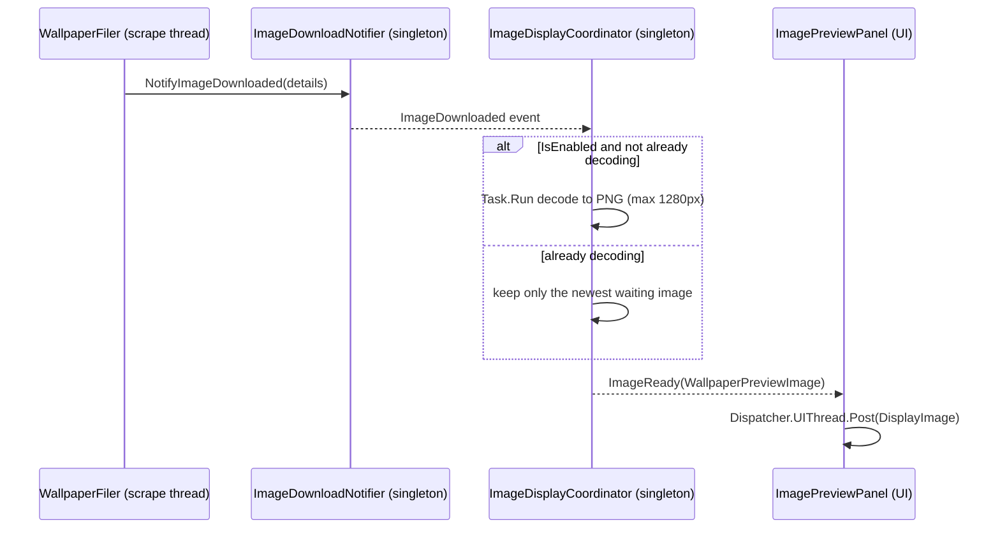

If downloads outpace decoding, intermediate images are dropped and only the latest is shown. A decode failure is swallowed, because a missing preview is not worth stopping a scrape.

Progress text follows a similar path: `ScrapeRunner` hands `IProgress<string>` to `StatusReporter`, which appends to the status log.

## 8. HTTP pipeline and rate limiting

There are three separate throttles. They exist because the Wallhaven API and the image host behave differently.

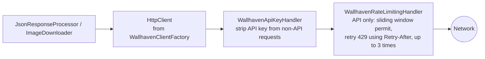

| Throttle | Where | Applies to |
|---|---|---|
| Sliding-window `RateLimiter` plus 429 retry | `WallhavenRateLimitingHandler` | Every request to the API path (search pages, tag detail) |
| Random 2-3s `DownloadPacing` | `ImageDownloader` | Before each image download |
| Same `DownloadPacing` | `PagesProcessor` | Before each page after the first, so skipping already-ingested pages does not trigger 429s |

Image downloads are not rate limited by the handler, and the API key is removed from them so it is never sent to the image host.

## 9. Cancellation, single-operation and failure rules

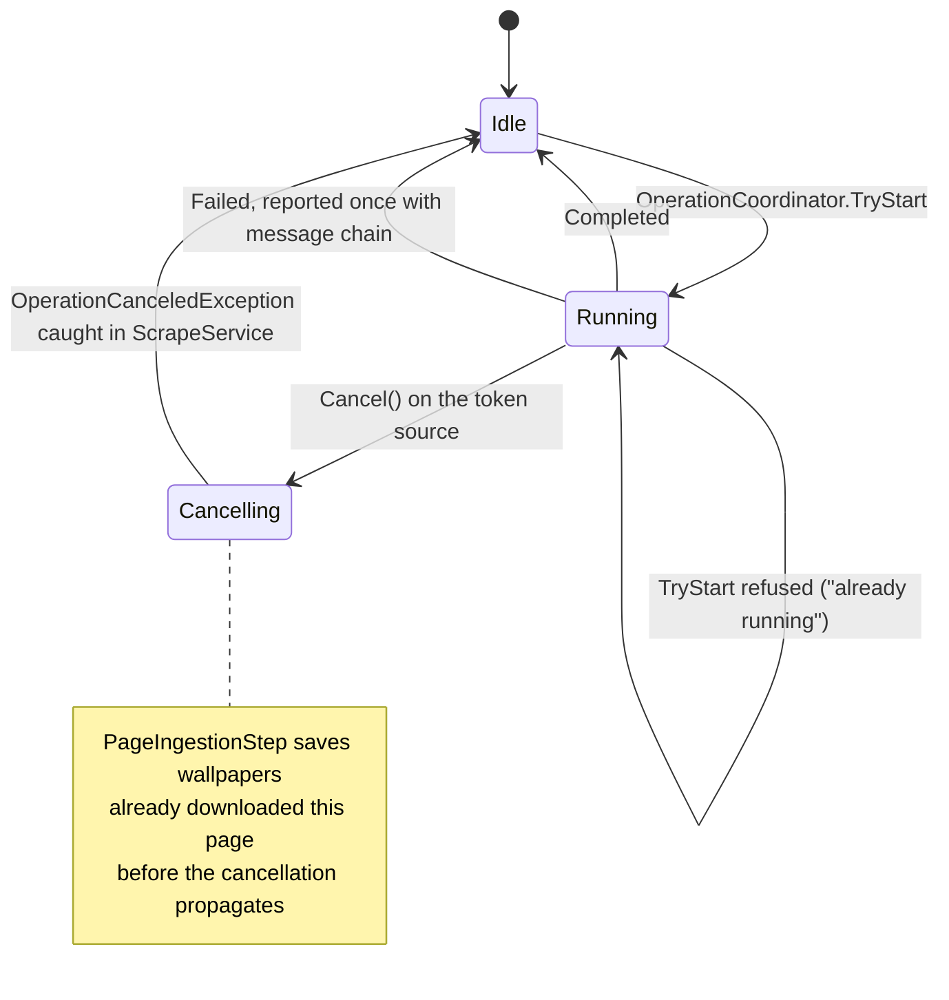

Failure scoping, from narrowest to widest:

- A wallpaper that fails to download or link is reported, the page is marked `Incomplete`, the scrape continues.
- A page that cannot be fetched throws `PageFetchException`, which ends only that search; the next search still runs, and its progress is withheld so it resumes next time.
- Anything else, or a cancellation, propagates to `ScrapeService`, the one place a scrape failure is reported.

## 10. Dependency injection and lifetimes

`Startup/ApplicationServices.cs` composes everything. The rule: a service's lifetime must not be longer than any of its dependencies'.

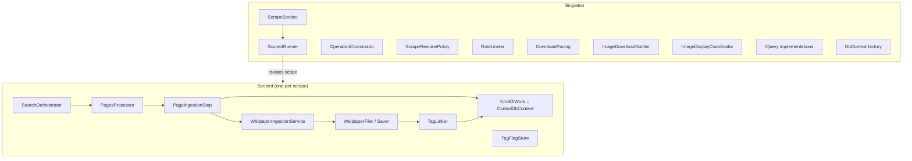

`ScrapeService` is a singleton, so it never takes scoped dependencies directly. It asks `ScopedRunner` for a fresh scope per scrape instead. The `IQuery<T>` implementations are singletons because the DbContext factory is a singleton and builds the context from the root provider, so a scoped dependency there would fail.

An integration test (`GivenTheApplicationServices`) builds the container with scope and build validation on, so a captive dependency fails the build.

## 11. Persistence

The main entities, all in `packages/AStarDev.ControlDb`:

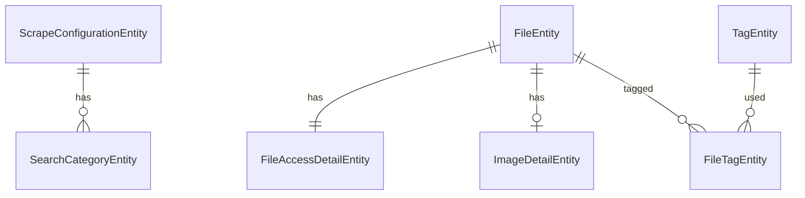

| Entity | Role in a scrape |
|---|---|
| `ScrapeConfigurationEntity` | API key, base URL, hot and top settings, search string prefix and suffix, root directories |
| `SearchCategoryEntity` | A category; stores `LastKnownImageCount`, `LastPageVisited`, `TotalPages` for resume |
| `FileEntity` | One saved wallpaper; its `FileHandle` is the Wallhaven id, which is how "already exists" is detected |
| `TagEntity` / `FileTagEntity` | Tags and their links; flags (ignore, name, famous) decide skipping and directories |

`IUnitOfWork` commits once per page (`PageIngestionStep`), so a page is saved as one batch.

## 12. Where to look when...

| You want to change | Start at |
|---|---|
| Which scrapes run, or limits | `SearchOrchestrator`, `ScrapeSelection`, `ScrapeLimits` |
| Resume / skip rules | `ScrapeResumePolicy`, `PagesProcessor` |
| Waits between requests | `DownloadPacing`, `WallhavenRateLimitingHandler`, `ApplicationConstants` |
| Where files are saved and named | `SaveDirectories`, `SaveDirectoryResolver`, `WallpaperFileNamer` |
| What is recorded in the DB | `WallpaperFileRecorder`, `TagLinker` |
| What is ignored | `TagFlagStore`, `TagFetcher`, `IgnoredWallpaperRecorder` |
| The preview and counts | `ImageDisplayCoordinator`, `ImagePreviewPanel`, `ScrapeTally`, `WallpaperInfo` |
| Service wiring | `Startup/ApplicationServices.cs`, `Startup/DataServices.cs` |
